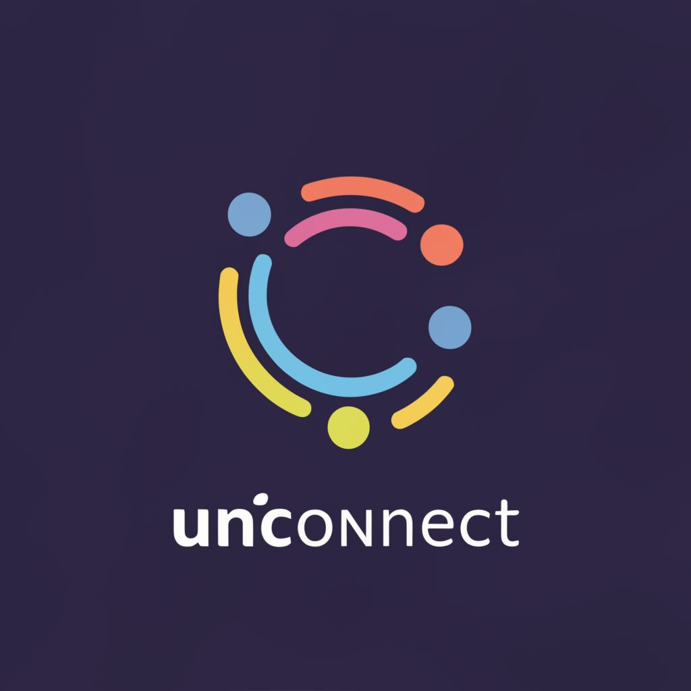

# UNICONNECT

Nama : Nafa Khairunnisa 
Grup : 4 (Empat) 
No. Peserta : 044

---

 

**UNICONNECT**

UNIConnect adalah platform untuk menghubungkan dan memberdayakan mahasiswa melalui Unit Kegiatan Mahasiswa (UKM) di universitas. Dengan UNIConnect, mahasiswa dapat dengan mudah mengakses informasi terkini tentang berbagai UKM, termasuk detail kegiatan, acara, dan pencapaian.

UNIConnect hadir untuk mendukung dan memfasilitasi partisipasi aktif mahasiswa dalam berbagai kegiatan kampus, memperkaya pengalaman mereka, dan membangun komunitas yang lebih terhubung dan dinamis.

